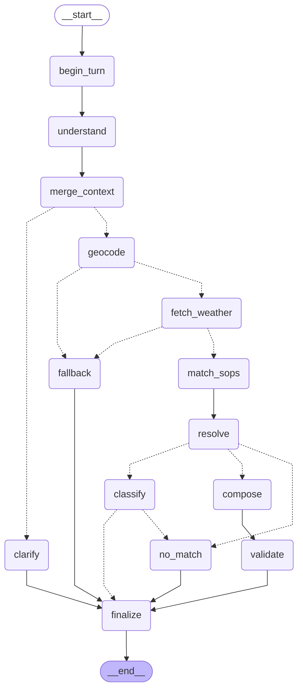

# Compiled graph topology

```mermaid
---
config:
  flowchart:
    curve: linear
---
graph TD;
	__start__([<p>__start__</p>]):::first
	begin_turn(begin_turn)
	understand(understand)
	merge_context(merge_context)
	clarify(clarify)
	geocode(geocode)
	fetch_weather(fetch_weather)
	fallback(fallback)
	match_sops(match_sops)
	resolve(resolve)
	classify(classify)
	no_match(no_match)
	compose(compose)
	validate(validate)
	finalize(finalize)
	__end__([<p>__end__</p>]):::last
	__start__ --> begin_turn;
	begin_turn --> understand;
	clarify --> finalize;
	classify -.-> finalize;
	classify -.-> no_match;
	compose --> validate;
	fallback --> finalize;
	fetch_weather -.-> fallback;
	fetch_weather -.-> match_sops;
	geocode -.-> fallback;
	geocode -.-> fetch_weather;
	match_sops --> resolve;
	merge_context -.-> clarify;
	merge_context -.-> geocode;
	no_match --> finalize;
	resolve -.-> classify;
	resolve -.-> compose;
	resolve -.-> no_match;
	understand --> merge_context;
	validate --> finalize;
	finalize --> __end__;
	classDef default fill:#f2f0ff,line-height:1.2
	classDef first fill-opacity:0
	classDef last fill:#bfb6fc

```
